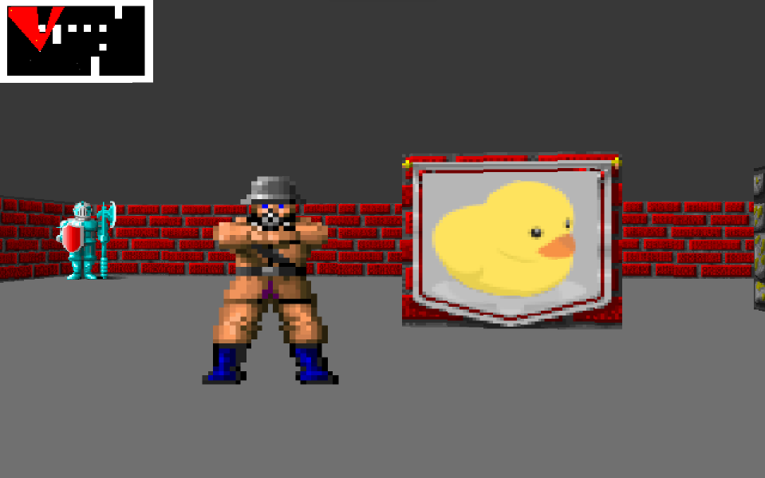

## Pikuma Raycaster

Implementation of the [Raycasting Engine Programming with C](https://pikuma.com/courses/raycasting-engine-tutorial-algorithm-javascript) course by Gustavo Pezzi.

Developed in WSL2/Ubuntu on Windows 11.

Should build with a simple `make` so long as SDL is installed (`sudo apt-get install libsdl2-dev`).

